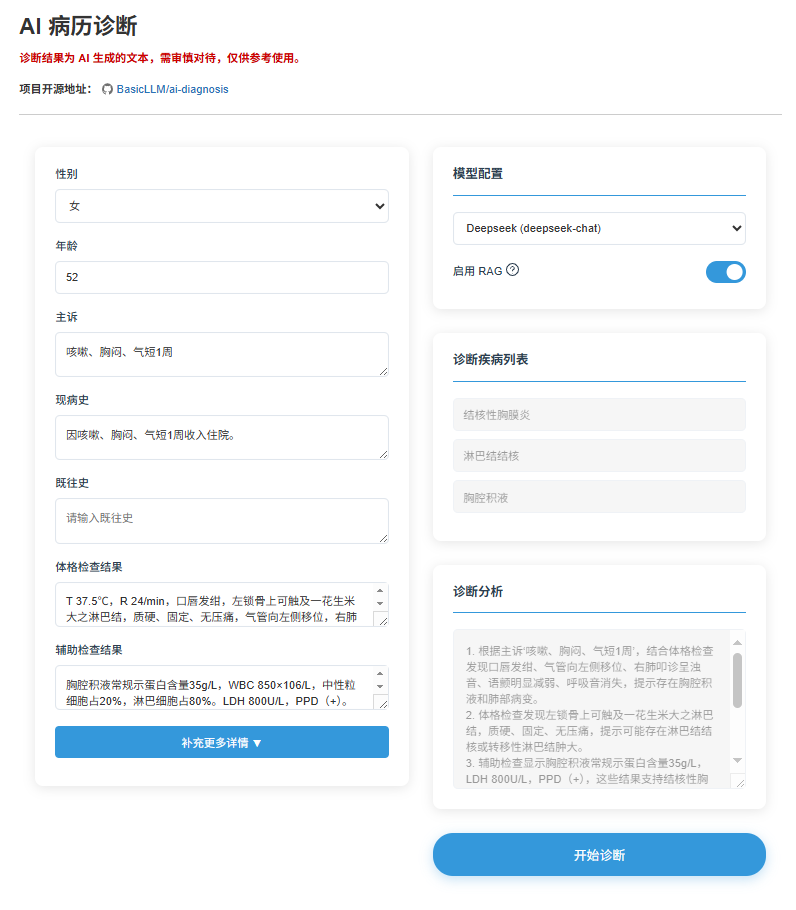

# AI 诊断项目后端

### 演示地址

https://zhangming.me/ai:demo:ai-diagnosis



### 诊断接口

**接口地址：** `/v1/ai/diagnose`

**请求方法：** POST

**请求参数：**

请求体(Body)配置如下：

| 字段                                | 类型      | 说明                              |
|-----------------------------------|---------|---------------------------------|
| setting                           | Object  | 模型设置                            |
| setting.provider                  | String  | 提供商（配置文件中的 `aichat.proxies.id`） |
| setting.model                     | String  | 模型名，需要根据提供商进行选择                 |
| setting.useRag                    | Boolean | 是否启用 RAG                        |
| condition                         | Object  | 病人身体状况                          |
| condition.gender                  | String  | 性别                              |
| condition.age                     | Number  | 年龄                              |
| condition.chiefComplaint          | String  | 主诉                              |
| condition.historyOfPresentIllness | String  | 现病史                             |
| condition.pastHistory             | String  | 既往史                             |
| condition.personalHistory         | String  | 个人史                             |
| condition.allergicHistory         | String  | 过敏史                             |
| condition.reproductiveHistory     | String  | 生育史（ TPAL 数据 ）                  |
| condition.pregnancyAndDelivery    | String  | 婚育史                             |
| condition.epidemicHistory         | String  | 流行病史                            |
| condition.physicalExamination     | String  | 体格检查结果                          |
| condition.auxiliaryExamination    | String  | 辅助检查结果                          |

**请求示例：**

```json
{
  "setting": {
    "provider": "deepseek",
    "model": "deepseek-chat",
    "useRag": true
  },
  "condition": {
    "gender": "男",
    "age": 49,
    "chiefComplaint": "右下腹痛并自扪及包块3小时",
    "historyOfPresentIllness": "3小时前解大便后出现右下腹疼痛，右下腹可触及一包块，既往体健",
    "pastHistory": "既往体健",
    "personalHistory": null,
    "allergicHistory": null,
    "reproductiveHistory": null,
    "pregnancyAndDelivery": null,
    "epidemicHistory": null,
    "physicalExamination": "T 37.8℃，P 101次/分，呼吸22次/分，BP 100/60mmHg。腹软，未见胃肠型蠕动波，肝脾肋下未及，右侧腹股沟区可扪及一圆形肿块(4cm×4cm)，有压痛、界欠清，肿块位于腹股沟韧带上内方",
    "auxiliaryExamination": "血常规：WBC 5.0×109/L，N 78%；尿常规正常；多普勒超声：腹股沟纵切见多层分布混合回声区(4-5cm)，远端膨大，边界整齐；腹部X线：阶梯状液气平"
  }
}
```

**返回参数：**

返回参数使用 ssh 服务器推流模式，返回结构如下：

| 字段       | 类型          | 说明   |
|----------|-------------|------|
| diseases | String List | 疾病列表 |
| reasons  | String      | 诊断分析 |

注意，第一次返回的值为疾病列表（diseases），后续返回的都是诊断分析 （reasons）

**返回示例：**

第一次返回：
```json lines
{"diseases":["腹股沟疝","阑尾炎","感染性发热"]}
```

后续返回：
```json lines
{"reasons":"患者"}
{"reasons":"主"}
{"reasons":"诉"}
```